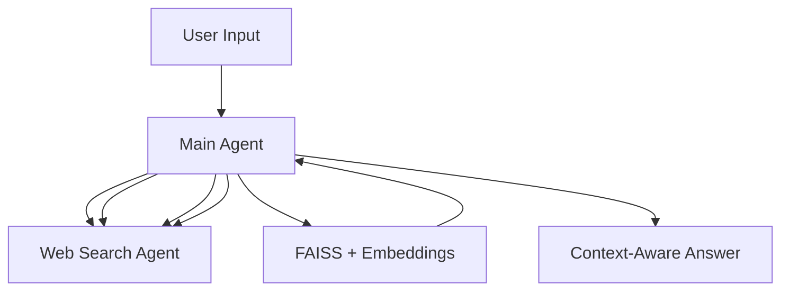

# 🤖 Agentic_AI

> **Agentic_AI** is a **multi-agent orchestration framework** powered by **LangChain + LangGraph + MCP** and accelerated by **Groq (LLaMA-3-70B)**.  
> It integrates specialized tools like **Math, Translation, Gmail, Weather, Web Search**, and features **memory persistence** with FAISS embeddings.

---

## ✨ Demo

🎥 *Demo GIF or screenshot placeholder*  
(Add a quick **terminal demo GIF** using [asciinema](https://asciinema.org/) or a screenshot of agents collaborating.)

---

## 🧠 Architecture

Here’s how the system is designed:

## 🚀 Features

  ⚡ Fast & Scalable: Powered by Groq’s LLaMA-3-70B

 🧮 Math Agent: Handles calculations & symbolic tasks

 🌍 Translator Agent: Supports multilingual conversations

 📧 Gmail Agent: Reads & interacts with Gmail API

 🔍 Web Search Agent: Searches online data for better answers

 🧠 Persistent Memory: Remembers conversations using FAISS + embeddings

 🧹 Memory Reset: Use clear to reset past memory when needed

## 🗂 Project Structure
Agentic_AI/
├── main.py              # Main entry point
├── mathserver.py        # Math agent (MCP)
├── translate.py         # Translator agent (MCP)
├── websearch.py         # Web search agent
├── gmail.py             # Gmail integration
├── rag_model.py         # Optional RAG pipeline
├── mcp_use.py           # MCP agent utilities
├── requirements.txt     # Dependencies
├── .env                 # API keys & config
└── README.md            # This file

## ⚙️ Getting Started
1️⃣ Clone the repository
 git clone https://github.com/sobhan2204/Agentic_AI.git
 cd Agentic_AI

2️⃣ Setup environment
 python3.10 -m venv venv
 source venv/bin/activate
 pip install -r requirements.txt

3️⃣ Configure .env
 GROQ_API_KEY=your_api_key_here
 HF_TOKEN=your_huggingface_token_here
 (Optional: add Gmail API credentials if using Gmail Agent)

4️⃣ Run the agent
 python main.py

## 📈 Roadmap

 Add finance/news/calendar agents

 Memory expiration + relevance scoring

 Web dashboard UI for interactions

 Dockerized deployment

## 🧰 Tech Stack

LangChain + LangGraph + MCP – multi-agent orchestration

Groq (LLaMA-3-70B) – blazing fast inference

FAISS + HuggingFace embeddings – vector memory store

Python 3.10+ – backend

## 🤝 Contributing

##💡 Contributions are welcome!

Fork the repo & create a feature branch

Submit a PR with clear description

For new MCP agents, follow modular design
