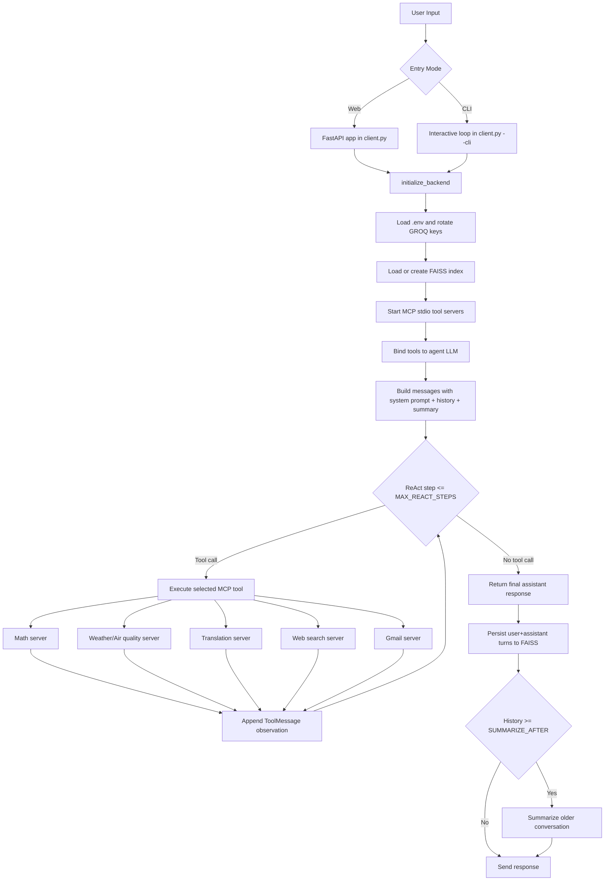

# Agentic AI Multi-Tool Assistant


An MCP-powered assistant that can use math, weather, translation, web search, and Gmail tools from one ReAct loop.

The current implementation uses one main entrypoint:

- API mode: `client.py` starts a FastAPI app on port 8080
- CLI mode: `client.py --cli` starts an interactive terminal chat

## What Is Implemented Now

- ReAct tool-calling loop with duplicate-call protection
- Multi-step tool chaining handled by the model
- FAISS memory with periodic conversation summarization
- FastAPI endpoints for chat, clear, and health
- 5 MCP stdio tool servers:
  - `mathserver.py` -> `solve_math`
  - `weather.py` -> `get_weather`, `get_air_quality`
  - `translate.py` -> `translate`
  - `websearch.py` -> `web_search`
  - `gmail.py` -> `send_email`, `read_emails`

## Workflow Diagram


```mermaid
flowchart TD
    A[User Input] --> B{Entry Mode}
    B -->|Web| C[FastAPI app in client.py]
    B -->|CLI| D[Interactive loop in client.py --cli]

    C --> E[initialize_backend]
    D --> E

    E --> E1[Load .env and rotate GROQ keys]
    E1 --> E2[Load or create FAISS index]
    E2 --> E3[Start MCP stdio tool servers]
    E3 --> F[Bind tools to agent LLM]

    F --> G[Build messages with system prompt + history + summary]
    G --> H{ReAct step <= MAX_REACT_STEPS}

    H -->|No tool call| I[Return final assistant response]
    H -->|Tool call| J[Execute selected MCP tool]

    J --> J1[Math server]
    J --> J2[Weather/Air quality server]
    J --> J3[Translation server]
    J --> J4[Web search server]
    J --> J5[Gmail server]

    J1 --> K[Append ToolMessage observation]
    J2 --> K
    J3 --> K
    J4 --> K
    J5 --> K

    K --> H
    I --> L[Persist user+assistant turns to FAISS]
    L --> M{History >= SUMMARIZE_AFTER}
    M -->|Yes| N[Summarize older conversation]
    M -->|No| O[Send response]
    N --> O
```

### Flow Summary

1. Input enters through web endpoint or CLI loop.
2. Backend initializes model, memory, and MCP tool connections.
3. Agent runs a ReAct loop and decides whether to call tools.
4. Tool results are fed back as observations until a final answer is produced.
5. Conversation is saved in FAISS, and older turns are summarized periodically.

## Project Structure

```text
agenticaimcp/
├── client.py
├── client_changes.py
├── server.py
├── main.py
├── executioner.py
├── intent_router.py
├── rule_based_verifier.py
├── mathserver.py
├── weather.py
├── translate.py
├── websearch.py
├── gmail.py
├── debug_script.py
├── website.html
├── Dockerfile
├── requirements.txt
├── pyproject.toml
└── faiss_index/
```

Notes:

- `client.py` is the primary runtime path.
- `server.py`, `executioner.py`, `intent_router.py`, and `rule_based_verifier.py` are still present as alternate/legacy components.
- `main.py` currently does not contain runtime logic.

## Setup

### 1) Install dependencies

```bash
pip install -r requirements.txt
```

### 2) Configure environment

Create a `.env` file in the project root:

```env
# Agent keys used by client.py (rotation supported)
GROQ_API_KEY_1=gsk_xxx
GROQ_API_KEY_2=gsk_xxx
GROQ_API_KEY_3=gsk_xxx

# Math tool currently reads GROQ_API_KEY directly
# You can set this to the same value as GROQ_API_KEY_1.
GROQ_API_KEY=gsk_xxx

# Required for web search tool
TAVILY_API_KEY=tvly-xxx

# Optional: Gmail token for local/headless usage (base64 encoded token.json)
# GMAIL_TOKEN_JSON=eyJ0eXBlIjogLi4u
```

### 3) Gmail auth options (optional)

`gmail.py` supports either:

- `/app/token.json` mounted into the container or runtime filesystem
- `GMAIL_TOKEN_JSON` environment variable (base64-encoded JSON token)

If neither is provided, Gmail tools will return an auth error.

## Run

### API mode (FastAPI + web UI)

```bash
python client.py
```

Or directly with uvicorn:

```bash
uvicorn client:app --host 0.0.0.0 --port 8080 --reload
```

Open:

- `http://localhost:8080/` for the HTML chat page
- `http://localhost:8080/health` for health status

### CLI mode

```bash
python client.py --cli
```

CLI commands:

- `clear` resets FAISS/chat memory
- `exit`, `quit`, or `q` exits

## API Endpoints

- `POST /chat`
  - Body: `{"message": "your prompt"}`
  - Returns: `{"response": "...", "status": "success|error"}`
- `POST /clear`
  - Resets memory and conversation state
- `GET /health`
  - Returns service status, loaded tools, and state metadata

Example:

```bash
curl -X POST http://localhost:8080/chat \
  -H "Content-Type: application/json" \
  -d '{"message": "weather in London"}'
```

## Docker

Build:

```bash
docker build -t my-app:latest .
```

Run (PowerShell example on Windows):

```bash
docker run -p 8080:8080 --env-file .env -v "D:\agenticaimcp\token.json:/app/token.json" my-app:latest
```

The container starts:

```bash
python -m uvicorn client:app --host 0.0.0.0 --port 8080
```

## Quick Tool Connectivity Check

```bash
python debug_script.py
```

This validates each MCP tool server can start and reports discovered tools.

## Configurable Runtime Knobs

In `client.py`:

```python
SUMMARIZE_AFTER = 6
MAX_REACT_STEPS = 6
TOOL_TIMEOUT = 60
```

## Tech Stack

- FastAPI
- LangChain
- MCP / FastMCP
- Groq chat models
- FAISS + sentence-transformers embeddings
- Tavily search
- Gmail API
- SymPy + SciPy

## Acknowledgments

- LangChain
- Groq
- Tavily
- FastMCP
