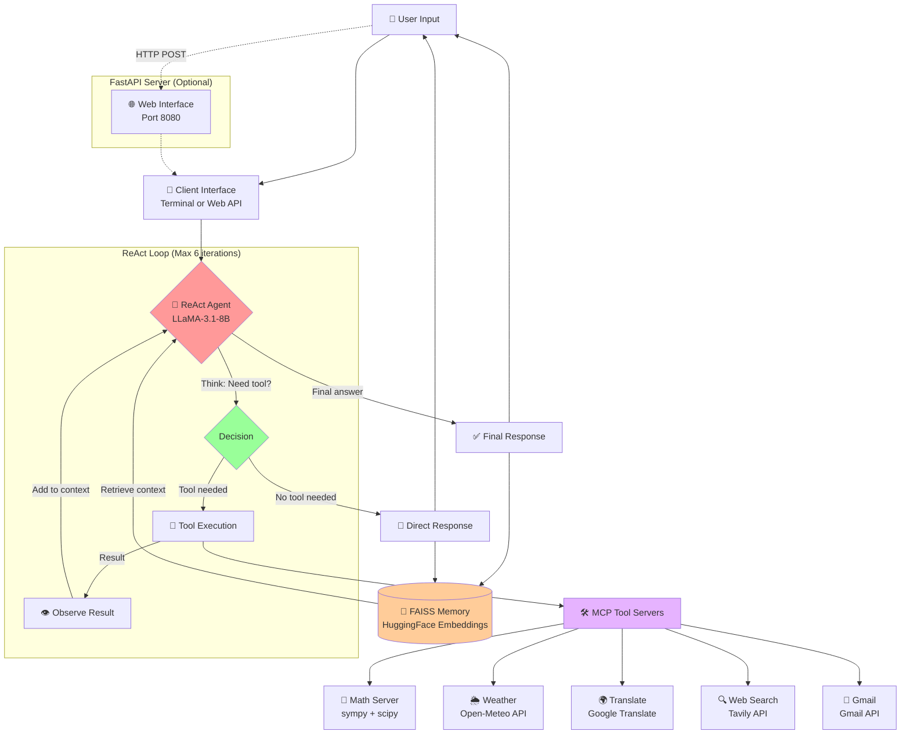

# 🤖 Agentic AI Multi-Tool Assistant


> An intelligent multi-agent AI system powered by **LangChain + LangGraph + MCP (Model Context Protocol)** with **ReAct-style reasoning**. Integrates 5 specialized tool servers (Math, Weather, Translation, Web Search, Gmail) with persistent FAISS memory and FastAPI web interface.

---

## ✨ Key Features

### 🧠 **Intelligent Agent Architecture**

- **ReAct Loop (Reasoning + Acting)**: LLM autonomously decides when to use tools through Think→Act→Observe cycles
- **Native Tool Calling**: Zero hardcoded routing - agent interprets tool schemas and chooses appropriate tools
- **Multi-Step Task Handling**: Automatically chains tool calls for complex queries (e.g., "search AI news and email results")
- **Duplicate Call Prevention**: Built-in loop detection prevents stuck tool calls

### 🛠️ **5 MCP Tool Servers**

| Tool | Capabilities | Transport |
|------|-------------|-----------|
| **🧮 Math Server** | Symbolic math (derivatives, integrals, equation solving), calculator | stdio |
| **🌦️ Weather** | Current weather, air quality via Open-Meteo API | stdio |
| **🌍 Translate** | Multi-language translation via Google Translate API | stdio |
| **🔍 Web Search** | Real-time web search powered by Tavily API | stdio |
| **📧 Gmail** | Send emails, read inbox via Gmail API | stdio |

### 💾 **Persistent Memory System**

- **FAISS Vector Database**: Stores conversation history as semantic embeddings
- **Context Retrieval**: Automatically fetches top 3 relevant past interactions
- **Conversation Summarization**: Summarizes long conversations every 6+ exchanges
- **Cross-Session Memory**: Maintains context between chat sessions

### 🌐 **Web Interface**

- **FastAPI Backend**: RESTful API with CORS support
- **Chat Endpoint**: `/chat` - Process user messages with full agent capabilities
- **Clear History**: `/clear` - Reset conversation memory
- **Health Check**: `/health` - Monitor system status

### 🔧 **Production Features**

- **API Key Rotation**: Supports 3 Groq API keys for rate limit handling
- **Retry Logic**: Automatic retry with exponential backoff for rate limits
- **Error Handling**: Graceful degradation with timeout protection (60s per tool)
- **Truncation**: Smart result truncation to prevent token overflow

---

## 🏗️ System Architecture


```mermaid
graph TB
    User[👤 User Input] --> Client[💬 Client Interface<br/>Terminal or Web API]
    
    Client --> AgentLLM{🧠 ReAct Agent<br/>LLaMA-3.1-8B}
    
    AgentLLM -->|"Think: Need tool?"| Decision{Decision}
    Decision -->|No tool needed| DirectReply[📝 Direct Response]
    Decision -->|Tool needed| ToolCall[🔧 Tool Execution]
    
    ToolCall --> MCPServers[🛠️ MCP Tool Servers]
    
    MCPServers --> MathTool[🧮 Math Server<br/>sympy + scipy]
    MCPServers --> WeatherTool[🌦️ Weather<br/>Open-Meteo API]
    MCPServers --> TranslateTool[🌍 Translate<br/>Google Translate]
    MCPServers --> SearchTool[🔍 Web Search<br/>Tavily API]
    MCPServers --> GmailTool[📧 Gmail<br/>Gmail API]
    
    ToolCall -->|Result| Observe[👁️ Observe Result]
    Observe -->|Add to context| AgentLLM
    
    AgentLLM -->|Final answer| Response[✅ Final Response]
    
    Response --> Memory[(🧠 FAISS Memory<br/>HuggingFace Embeddings)]
    DirectReply --> Memory
    
    Memory -->|Retrieve context| AgentLLM
    
    Response --> User
    DirectReply --> User
    
    subgraph "ReAct Loop (Max 6 iterations)"
        AgentLLM
        Decision
        ToolCall
        Observe
    end
    
    subgraph "FastAPI Server (Optional)"
        API[🌐 Web Interface<br/>Port 8080]
    end
    
    User -.->|HTTP POST| API
    API -.-> Client
    
    style AgentLLM fill:#ff9999
    style Memory fill:#ffcc99
    style MCPServers fill:#e6b3ff
    style Decision fill:#99ff99
```

### **How It Works**

1. **Input Processing**: User sends query via CLI or API
2. **ReAct Loop**: Agent enters Think→Act→Observe cycle:
   - **Think**: Decides if a tool is needed based on query
   - **Act**: Calls appropriate tool(s) with generated arguments
   - **Observe**: Processes tool output and decides next action
3. **Memory Integration**: FAISS retrieves relevant past context automatically
4. **Response Generation**: Agent synthesizes final answer after ≤6 tool calls
5. **Memory Update**: Conversation stored as embeddings for future retrieval

---

## 📂 Project Structure

```
agentic-ai-mcp/
├── client.py                 # Main CLI chat interface (ReAct agent)
├── server.py                 # FastAPI web server
├── intent_router.py          # LLM-based query understanding
├── executioner.py            # Tool execution pipeline
├── rule_based_verifier.py    # Response validation logic
│
├── Tool Servers (MCP)
│   ├── mathserver.py         # Math calculations (sympy, scipy)
│   ├── weather.py            # Weather & air quality
│   ├── translate.py          # Language translation
│   ├── websearch.py          # Tavily web search
│   └── gmail.py              # Gmail send/read
│
├── Utilities
│   ├── debug_script.py       # Test MCP server connectivity
│   ├── test_servers.py       # Validate individual servers
│   └── personalized_task.py  # Custom workflow placeholder
│
├── Configuration
│   ├── .env                  # API keys (not in repo)
│   ├── requirment.txt        # Python dependencies
│   ├── pyproject.toml        # Project metadata
│   └── .gitignore
│
├── Memory Storage
│   └── faiss_index/
│       └── index.faiss       # Vector embeddings
│
├── Auth (not in repo)
│   ├── credentials.json      # Google OAuth credentials
│   └── token.json            # Gmail access token
│
└── README.md
```

---

## ⚙️ Installation & Setup

### **1️⃣ Prerequisites**

- Python 3.13+
- Git
- API Keys:
  - **Groq API** (for LLaMA models)
  - **Tavily API** (for web search)
  - **Google Cloud** (for Gmail - optional)

### **2️⃣ Clone Repository**

```bash
git clone https://github.com/sobhan2204/agentic-ai-mcp.git
cd agentic-ai-mcp
```

### **3️⃣ Install Dependencies**

```bash
pip install -r requirment.txt
```

### **4️⃣ Configure Environment**

Create a `.env` file:

```bash
# Groq API Keys (get from https://console.groq.com)
GROQ_API_KEY_1=gsk_xxxxxxxxxxxxxxxxxxxxx
GROQ_API_KEY_2=gsk_xxxxxxxxxxxxxxxxxxxxx  # Optional for rotation
GROQ_API_KEY_3=gsk_xxxxxxxxxxxxxxxxxxxxx  # Optional

# Tavily API (get from https://tavily.com)
TAVILY_API_KEY=tvly-xxxxxxxxxxxxxxxx
```

### **5️⃣ Gmail Setup (Optional)**

If using Gmail features:

1. Create OAuth credentials at [Google Cloud Console](https://console.cloud.google.com/)
2. Download as `credentials.json`
3. First run will open browser for authentication
4. Token saved as `token.json` for future use

---

## 🚀 Usage

### **Option 1: Terminal Chat (Recommended)**

```bash
python client.py
```

**Example Interaction:**

```
You: what is 5 + 5
  [Tool: solve_math({"query": "5 + 5"})]
Assistant: The result is 10.

You: translate "good morning" to french
  [Tool: translate({"sentence": "good morning", "target_language": "french"})]
Assistant: "Good morning" in French is "bonjour".

You: search latest AI news and email to bob@test.com
  [Tool: search_web({"query": "latest AI news"})]
  [Tool: send_email({"recipient": "bob@test.com", "subject": "AI Update", "body": "..."})]
Assistant: I found recent AI news and sent it to bob@test.com.

You: clear                     # Reset conversation memory
Conversation cleared.

You: exit
Bye bye!
```

### **Option 2: Web API**

Start the server:

```bash
python server.py
```

**API Endpoints:**

```bash
# Send chat message
curl -X POST http://localhost:8080/chat \
  -H "Content-Type: application/json" \
  -d '{"message": "what is the weather in London?"}'

# Clear conversation
curl -X POST http://localhost:8080/clear

# Health check
curl http://localhost:8080/health
```

### **🧪 Test MCP Servers**

Before running the main client, verify all tools work:

```bash
python test_servers.py
```

Expected output:
```
Testing mathserver.py... ✅ WORKING
Testing weather.py... ✅ WORKING
Testing translate.py... ✅ WORKING
Testing websearch.py... ✅ WORKING
Testing gmail.py... ✅ WORKING
```

---

## 🎯 Example Use Cases

| Query | Tools Used | Result |
|-------|-----------|--------|
| "solve x^2 - 4 = 0" | `solve_math` | Solutions: x = -2, 2 |
| "weather in Tokyo" | `get_weather` | Current weather with temperature |
| "translate 'hello' to spanish" | `translate` | "hola" |
| "latest news on AI" | `search_web` | Top 3 news articles with sources |
| "send email to alice@test.com" | `send_email` | Email sent confirmation |
| "search AI news and email it to bob@test.com" | `search_web` → `send_email` | Multi-step: search then email |

---

## 🛠️ Configuration Options

### **Memory Settings**

Edit in `client.py`:

```python
SUMMARIZE_AFTER = 6   # Summarize every N user-assistant exchanges
MAX_REACT_STEPS = 6   # Max tool calls per turn
TOOL_TIMEOUT    = 60  # Seconds before tool call times out
```

### **Model Selection**

Edit in `client.py`:

```python
agent_llm = ChatGroq(
    model="llama-3.1-8b-instant",  # Fast for tool calling
    max_tokens=1024,
    temperature=0.0,                # Deterministic for reliability
)
```

### **API Key Rotation**

The system automatically cycles through 3 API keys to handle rate limits. Configure in `.env`.

---

## 🧹 Commands

| Command | Action |
|---------|--------|
| `clear` | Reset FAISS memory and conversation history |
| `exit` / `quit` / `q` | Exit the chat |
| *Any other text* | Process as user query |

---

## 🤝 Contributing

Contributions welcome! To add a new tool:

1. Create `newtool.py` following MCP FastMCP format
2. Register in `client.py` `MultiServerMCPClient` config
3. Test with `test_servers.py`
4. Update this README

---

## 📝 Tech Stack

| Component | Technology |
|-----------|-----------|
| **Agent Framework** | LangChain + LangGraph |
| **LLM** | Groq (LLaMA-3.1-8B-Instant) |
| **Tool Protocol** | MCP (FastMCP) |
| **Vector DB** | FAISS |
| **Embeddings** | HuggingFace (all-MiniLM-L6-v2) |
| **Web Framework** | FastAPI |
| **Math Engine** | SymPy + SciPy |
| **Translation** | deep-translator (Google Translate) |
| **Search** | Tavily API |
| **Email** | Gmail API (OAuth2) |

---

##  Acknowledgments

- [LangChain](https://github.com/langchain-ai/langchain) for agent framework
- [Groq](https://groq.com) for fast LLM inference
- [Tavily](https://tavily.com) for web search API
- [FastMCP](https://github.com/jlowin/fastmcp) for tool server protocol

---

**Made with ❤️ by [Sobhan](https://github.com/sobhan2204)**
