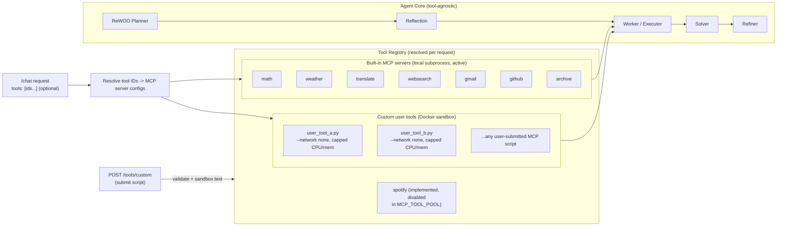
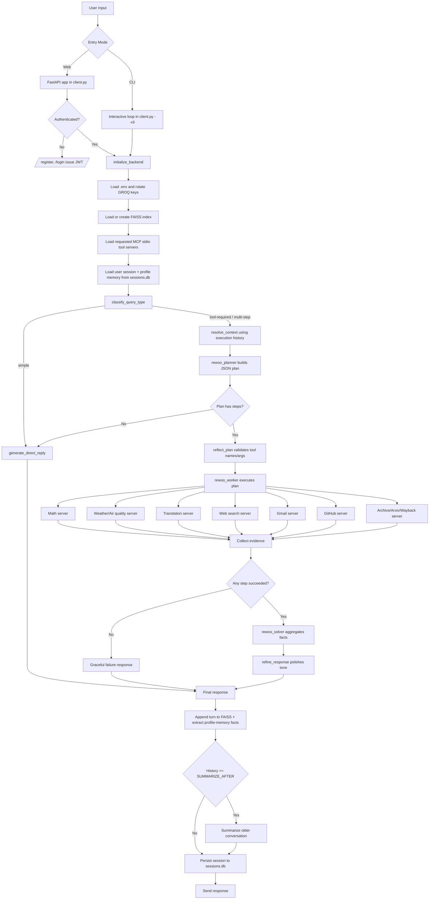

# Agentic AI — A Pluggable Agent Architecture


This is not a fixed assistant with a handful of tools bolted on — it's a **general-purpose agent architecture**. The core is a tool-agnostic reasoning/orchestration layer (a hybrid **ReWOO (Reasoning Without Observation) + Reflection + Refiner** pipeline, JWT-authenticated multi-user sessions, and FAISS-backed memory) that treats every tool — built-in or user-supplied — as a swappable **MCP server** loaded into the plan at runtime.

The system ships with 7 active reference tool servers (math, weather, translation, web search, Gmail, GitHub, archive/research) exposing 12 callable tools, plus a Spotify mood-recommendation server that exists in the codebase but is currently disabled in the registry — but those are just the default tool registry, not the ceiling of what the agent can do. Any user can register their **own** Python MCP tool script at runtime via the API — no redeploy, no change to the core pipeline — and it becomes callable by the planner exactly like a built-in tool. Custom tools run inside a throwaway, network-isolated, resource-capped Docker sandbox, so arbitrary user code can be plugged in without exposing the main app's filesystem, secrets, or network.

The current implementation uses one main entrypoint:

- API mode: `client.py` starts a FastAPI app on port 8080
- CLI mode: `client.py --cli` starts an interactive terminal chat

## Why This Project Exists

Most "AI agent" projects wire a language model directly to a fixed handful of tools inside one codebase. Adding a new capability means editing and redeploying the core application, and there is no safe way for an end user to bring their own tool — every capability is decided upfront by the developer. This project exists to remove both of those constraints.

The reasoning core here — a ReWOO (Reasoning Without Observation) planner, reflection, worker, solver, and refiner pipeline — never imports tool code directly. It discovers tool names and schemas at connection time over MCP (Model Context Protocol) and treats every tool identically, whether it ships with the project or was uploaded by a user five seconds ago. That single design decision is what turns this from "a chatbot with some tools" into a general-purpose, extensible agent platform:

- **Tools are swappable, not hardcoded.** Adding, removing, or updating a tool is a registry change, never a change to the planning or reasoning logic.
- **Users can extend the agent themselves.** Any authenticated user can submit their own Python MCP tool script through the API at runtime — no redeploy, no code review by the maintainer, no change to `client.py`.
- **User-submitted code is untrusted by default, and treated that way.** Every custom tool call runs inside a fresh, network-isolated, resource-capped, read-only Docker sandbox that is destroyed after a single use, so arbitrary user code can be plugged in without ever touching the main app's filesystem, secrets, or network.
- **Sessions and memory are real, not stateless demos.** Per-user JWT auth, SQLite-backed session and profile memory, and FAISS-backed long-term semantic memory mean the agent remembers who it's talking to and what happened earlier — across turns and across sessions.

## What This Project Does

At its core, this is a multi-user, tool-using AI agent server that you can talk to over a REST API or a terminal CLI, and that you can extend with new capabilities without redeploying it.

When a message comes in, the system classifies it as a simple greeting, a tool-required question, or a multi-step task; simple queries get a direct reply, while everything else is planned, reflected on, executed against real tools, aggregated into an answer, and polished before being returned. Every turn is persisted to both short-term session storage and long-term vector memory, and older history is periodically summarized so context doesn't grow unbounded.

Out of the box it ships with reference tools for math, weather and air quality, translation, web search, Gmail, GitHub, and academic/archive research (Arxiv, Internet Archive, Wayback Machine) — but those are just the default toolkit, not the boundary of what the agent can do. The real product is the architecture underneath: a tool-agnostic reasoning engine, a per-user extensible tool registry, and a sandboxing layer that makes "let anyone plug in any tool" a safe thing to offer.

## What Is Implemented Now

- Query classification (`simple` / `tool-required` / `multi-step`) that routes greetings straight to a direct reply and everything else into the ReWOO pipeline
- ReWOO planner → reflection → worker → solver → refiner pipeline, with a context-resolution step that rewrites ambiguous follow-ups ("do it again", "that result") using prior tool executions
- Per-user JWT authentication (`/register`, `/login`) backed by a SQLite store (`sessions.db`) for users, chat sessions, confirmed profile-memory facts, and registered custom tools
- FAISS vector memory (conversation turns + extracted profile-memory facts) with periodic LLM summarization of older history
- Two-tier memory design: **short-term session memory** (SQLite, per-user chat/session state) + **long-term semantic memory** (FAISS, embedded conversation history and profile facts for cross-session recall)
- Runtime tool selection: a chat request can restrict which MCP tools (built-in or custom) are loaded for that turn
- **Pluggable custom tools**: users submit a Python MCP tool script via the API; it's validated, registered per-user, and executed in an isolated Docker sandbox (`--network none`, memory/CPU/PID caps, read-only mount) — see [Custom Tools](#custom-tools-plug-and-play) below
- FastAPI endpoints for register, login, chat, clear, health, and custom tool CRUD
- 7 active built-in MCP stdio tool servers, registered in `MCP_TOOL_POOL` in `client.py` (the default registry):
  - `mathserver.py` -> `solve_math`
  - `weather.py` -> `get_weather`, `get_air_quality` (Open-Meteo geocoding + forecast + air-quality APIs)
  - `translate.py` -> `translate`
  - `websearch.py` -> `web_search` (Tavily-backed)
  - `gmail.py` -> `send_email`, `read_emails`
  - `github.py` -> `github_tool`, `code_executor`, `code_writer`, `github_run_review` — GitHub API access, sandboxed code execution, code generation, and automated code review
  - `archive.py` -> `arxiv_research_search`, `archive_research_search`, `wayback_snapshot` — Arxiv paper search, Internet Archive (books/audio/video) search, and Wayback Machine snapshot lookup, each with an LLM-generated summary
  - `spotify.py` -> `spotify_mood_recommend` (mood-based music recommendations) — implemented but **commented out** in `MCP_TOOL_POOL`, so it is not currently loadable by the planner

## Architecture

The agent core never hardcodes which tools exist. At the start of a turn it resolves the caller's requested tool IDs into a set of MCP server configs — some spawned as local Python subprocesses (built-ins), some spawned as sandboxed Docker containers (custom, user-submitted) — and hands the merged tool set to the planner.


```mermaid
flowchart LR
    subgraph Core["Agent Core (tool-agnostic)"]
        direction TB
        PL[ReWOO Planner]
        RF[Reflection]
        WK[Worker / Executor]
        SV[Solver]
        RN[Refiner]
        PL --> RF --> WK --> SV --> RN
    end

    subgraph Registry["Tool Registry (resolved per request)"]
        direction TB
        subgraph Builtin["Built-in MCP servers (local subprocess, active)"]
            T1[math]
            T2[weather]
            T3[translate]
            T4[websearch]
            T5[gmail]
            T6[github]
            T7[archive]
        end
        T8["spotify (implemented, disabled\nin MCP_TOOL_POOL)"]
        subgraph Custom["Custom user tools (Docker sandbox)"]
            U1["user_tool_a.py\n--network none, capped CPU/mem"]
            U2["user_tool_b.py\n--network none, capped CPU/mem"]
            U3["...any user-submitted MCP script"]
        end
    end

    Req["/chat request\ntools: [ids...] (optional)"] --> Resolve[Resolve tool IDs -> MCP server configs]
    Resolve --> Builtin
    Resolve --> Custom
    Builtin --> WK
    Custom --> WK

    API["POST /tools/custom\n(submit script)"] -->|validate + sandbox test| Registry
```

**How this differs from a fixed agent:** the planner never imports tool code directly — it only knows MCP tool names/schemas discovered at connection time. Swapping, adding, or removing a tool is a registry change (a new row in `sessions.db` for custom tools, or a new entry in `MCP_TOOL_POOL` for built-ins), never a change to the planning/reflection/solving logic.

## Workflow Diagram


```mermaid
flowchart TD
    A[User Input] --> B{Entry Mode}
    B -->|Web| C[FastAPI app in client.py]
    B -->|CLI| D[Interactive loop in client.py --cli]

    C --> Auth{Authenticated?}
    Auth -->|No| Login[/register, /login issue JWT/]
    Auth -->|Yes| E[initialize_backend]
    D --> E

    E --> E1[Load .env and rotate GROQ keys]
    E1 --> E2[Load or create FAISS index]
    E2 --> E3[Load requested MCP stdio tool servers]
    E3 --> F[Load user session + profile memory from sessions.db]

    F --> G[classify_query_type]
    G -->|simple| H1[generate_direct_reply]
    G -->|tool-required / multi-step| H2[resolve_context using execution history]

    H2 --> P1[rewoo_planner builds JSON plan]
    P1 --> P2{Plan has steps?}
    P2 -->|No| H1
    P2 -->|Yes| P3[reflect_plan validates tool names/args]

    P3 --> W[rewoo_worker executes plan]
    W --> W1[Math server]
    W --> W2[Weather/Air quality server]
    W --> W3[Translation server]
    W --> W4[Web search server]
    W --> W5[Gmail server]
    W --> W6[GitHub server]
    W --> W7[Archive/Arxiv/Wayback server]

    W1 --> EV[Collect evidence]
    W2 --> EV
    W3 --> EV
    W4 --> EV
    W5 --> EV
    W6 --> EV
    W7 --> EV

    EV --> EVC{Any step succeeded?}
    EVC -->|No| FB[Graceful failure response]
    EVC -->|Yes| S[rewoo_solver aggregates facts]
    S --> RF[refine_response polishes tone]

    H1 --> OUT[Final response]
    FB --> OUT
    RF --> OUT

    OUT --> SAVE[Append turn to FAISS + extract profile-memory facts]
    SAVE --> SUM{History >= SUMMARIZE_AFTER}
    SUM -->|Yes| SUMDO[Summarize older conversation]
    SUM -->|No| PERSIST[Persist session to sessions.db]
    SUMDO --> PERSIST
    PERSIST --> Resp[Send response]
```

### Flow Summary

1. Input enters through the web endpoint (JWT-protected) or CLI loop.
2. Backend initializes model pools, FAISS memory, and the requested MCP tool connections.
3. The query is classified as simple, tool-required, or multi-step.
4. Simple queries get a direct reply; everything else goes through context resolution, planning, plan reflection, plan execution, fact aggregation, and response refinement.
5. The turn is persisted to FAISS and SQLite, profile-memory facts are extracted, and older history is summarized once it grows past `SUMMARIZE_AFTER`.

## Project Structure

```text
agenticaimcp/
├── client.py             # primary runtime: FastAPI + CLI, ReWOO pipeline, auth, sessions, tool registry
├── client_changes.py     # alternate/in-progress orchestrator variant
├── mathserver.py         # built-in MCP server
├── weather.py            # built-in MCP server
├── translate.py          # built-in MCP server
├── websearch.py          # built-in MCP server
├── gmail.py              # built-in MCP server
├── spotify.py            # built-in MCP server (implemented, disabled in MCP_TOOL_POOL)
├── github.py             # built-in MCP server
├── archive.py            # built-in MCP server (arxiv + Internet Archive + Wayback)
├── debug_script.py
├── website.html          # web chat UI + custom tool management UI
├── website_try.html
├── Dockerfile            # main app image (includes docker-ce-cli for sandbox spawning)
├── Dockerfile.sandbox    # minimal, network-less image that runs one custom tool script
├── docker-compose.yml    # main app + docker-outside-of-docker mount for sandboxing
├── entrypoint.sh
├── ecs-trust-policy.json # AWS ECS deployment trust policy
├── requirements.txt
├── pyproject.toml
├── sessions.db           # SQLite: users, sessions, profile memory, custom tool registrations
├── user_scripts/         # per-user custom tool scripts (mounted into sandbox containers)
└── faiss_index/
```

Notes:

- `client.py` is the primary runtime path.
- `client_changes.py` is kept as an alternate/experimental orchestrator.
- `main.py` currently does not contain runtime logic.

## Setup

### 1) Install dependencies

```bash
pip install -r requirements.txt
```

### 2) Configure environment

Create a `.env` file in the project root:

```env
# Agent keys used by client.py (rotation supported)
GROQ_API_KEY_1=gsk_xxx
GROQ_API_KEY_2=gsk_xxx
GROQ_API_KEY_3=gsk_xxx

# Math tool currently reads GROQ_API_KEY directly
# You can set this to the same value as GROQ_API_KEY_1.
GROQ_API_KEY=gsk_xxx

# Required for web search tool
TAVILY_API_KEY=tvly-xxx

# Required: signs JWT access tokens issued by /login
JWT_SECRET_KEY=change-me
# Optional: token lifetime in minutes (default 60)
JWT_EXPIRE_MINUTES=60

# Optional: Gmail token for local/headless usage (base64 encoded token.json)
# GMAIL_TOKEN_JSON=eyJ0eXBlIjogLi4u
```

### 3) Gmail auth options (optional)

`gmail.py` supports either:

- `/app/token.json` mounted into the container or runtime filesystem
- `GMAIL_TOKEN_JSON` environment variable (base64-encoded JSON token)

If neither is provided, Gmail tools will return an auth error.

The Docker `entrypoint.sh` writes `GOOGLE_CREDENTIALS_JSON` and `GOOGLE_TOKEN_JSON` env vars to `/app/credentials.json` and `/app/token.json` at container start, and fails fast if either is missing.

## Run

### API mode (FastAPI + web UI)

```bash
python client.py
```

Or directly with uvicorn:

```bash
uvicorn client:app --host 0.0.0.0 --port 8080 --reload
```

Open:

- `http://localhost:8080/` for the HTML chat page
- `http://localhost:8080/health` for health status

On first startup a default `admin` / `admin` user is created in `sessions.db` if no users exist yet.

### CLI mode

```bash
python client.py --cli
```

CLI commands:

- `clear` resets FAISS/chat memory
- `exit`, `quit`, or `q` exits

## API Endpoints

- `POST /register`
  - Body: `{"username": "...", "password": "..."}`
  - Creates a new user
- `POST /login`
  - Body: `{"username": "...", "password": "..."}`
  - Returns: `{"access_token": "...", "token_type": "bearer"}`
- `POST /chat` (requires `Authorization: Bearer <token>`)
  - Body: `{"message": "your prompt", "tools": ["weather", "math"]}` (`tools` is optional; omit to load all tools)
  - Returns: `{"response": "...", "status": "success|error"}`
- `POST /clear` (requires `Authorization: Bearer <token>`)
  - Resets the authenticated user's session
- `POST /tools/custom` (requires `Authorization: Bearer <token>`)
  - Body: `{"name": "my_tool", "code": "<python MCP tool script>"}`
  - Validates the script (sandbox smoke test), registers it, returns `{"status": "success", "tool_id": "...", "tools": [...]}`
- `GET /tools/custom` (requires `Authorization: Bearer <token>`)
  - Lists the caller's registered custom tools and their status
- `DELETE /tools/custom/{name}` (requires `Authorization: Bearer <token>`)
  - Removes a registered custom tool
- `GET /health`
  - Returns service status, loaded tools, and cached tool-pool metadata

Example:

```bash
TOKEN=$(curl -s -X POST http://localhost:8080/login \
  -H "Content-Type: application/json" \
  -d '{"username": "admin", "password": "admin"}' | jq -r .access_token)

curl -X POST http://localhost:8080/chat \
  -H "Content-Type: application/json" \
  -H "Authorization: Bearer $TOKEN" \
  -d '{"message": "weather in London"}'
```

## Custom Tools (Plug and Play)

This is the core "architecture, not a fixed agent" feature: any authenticated user can extend the agent with their own tool at runtime, without redeploying or touching `client.py`.

### 1) Write an MCP tool script

Any valid MCP (FastMCP) tool server works — same shape as the built-in servers (`weather.py`, `websearch.py`, etc.):

```python
# my_tool.py
from mcp.server.fastmcp import FastMCP

mcp = FastMCP("my_tool")

@mcp.tool()
def roll_dice(sides: int = 6) -> str:
    """Roll an N-sided die."""
    import random
    return str(random.randint(1, sides))

if __name__ == "__main__":
    mcp.run(transport="stdio")
```

### 2) Register it

```bash
curl -X POST http://localhost:8080/tools/custom \
  -H "Content-Type: application/json" \
  -H "Authorization: Bearer $TOKEN" \
  -d "$(python -c 'import json,sys; print(json.dumps({"name":"my_tool","code":open("my_tool.py").read()}))')"
```

The backend writes the script to `user_scripts/<user_id>/my_tool.py`, runs a validation pass (spins it up once to confirm it starts and exposes valid MCP tool schemas), and — if it passes — stores it in `sessions.db` as `custom_<user_id>_my_tool`.

### 3) Use it in chat

```bash
curl -X POST http://localhost:8080/chat \
  -H "Content-Type: application/json" \
  -H "Authorization: Bearer $TOKEN" \
  -d '{"message": "roll a 20 sided die", "tools": ["custom_<user_id>_my_tool"]}'
```

Or omit `tools` to let the planner pick from every built-in and custom tool available to that user.

### Sandboxing

Every custom tool invocation spawns a fresh container from the minimal `Dockerfile.sandbox` image:

- `--network none` — no network access, so it can't exfiltrate data or call external services
- `--memory 256m --cpus 0.5 --pids-limit 64` — capped resource usage
- `--read-only`, script mounted read-only — no writes to the host or persistence between calls
- no app code, `.env`, or credentials inside the image — only `mcp` + `requests` are installed
- runs as an unprivileged user, torn down (`--rm`) after the single stdio session ends

The main app container talks to Docker via a mounted socket (`docker-outside-of-docker`, see `docker-compose.yml`) to spawn these sandboxes without embedding a Docker daemon inside itself.

## Docker

Two images are involved: the main app (`Dockerfile`) and the custom-tool sandbox (`Dockerfile.sandbox`, referenced by `SANDBOX_IMAGE` in `client.py`).

### Option A: docker-compose (recommended — wires up sandboxing)

```bash
docker build -t agentic-ai-sandbox:latest -f Dockerfile.sandbox .
docker compose up --build
```

`docker-compose.yml` mounts `/var/run/docker.sock` into the app container so it can spawn sandbox containers for custom tools (docker-outside-of-docker), and gives it a named volume for `user_scripts/`.

### Option B: plain `docker run` (no custom-tool sandboxing)

Build:

```bash
docker build -t my-app:latest .
```

Run (PowerShell example on Windows):

```bash
docker run -p 8080:8080 --env-file .env \
  -e GOOGLE_CREDENTIALS_JSON="$(cat credentials.json)" \
  -e GOOGLE_TOKEN_JSON="$(cat token.json)" \
  my-app:latest
```

The container starts:

```bash
python -m uvicorn client:app --host 0.0.0.0 --port 8080
```

Without the mounted Docker socket, custom-tool registration will still validate scripts but chat requests that select a custom tool will fail to spawn its sandbox — use Option A for full functionality.

## Quick Tool Connectivity Check

```bash
python debug_script.py
```

This validates each MCP tool server can start and reports discovered tools.

## Configurable Runtime Knobs

In `client.py`:

```python
SUMMARIZE_AFTER   = 6
MAX_REACT_STEPS   = 6
TOOL_TIMEOUT      = 60
EVIDENCE_MAX_CHARS = 1200
JWT_EXPIRE_MINUTES = 60  # via env, default shown
```

## Tech Stack

- FastAPI
- LangChain / LangGraph
- MCP / FastMCP (`langchain-mcp-adapters`)
- Groq chat models (`llama-3.1-8b-instant`, `llama-3.3-70b-versatile`)
- FAISS + sentence-transformers embeddings
- Tavily search
- Gmail API, GitHub API
- Docker (docker-outside-of-docker sandboxing for custom tools)
- SQLite (users, sessions, profile memory, custom tool registry)
- python-jose + passlib/bcrypt (JWT auth)
- SymPy, deep-translator

## Acknowledgments

- LangChain
- Groq
- Tavily
- FastMCP
